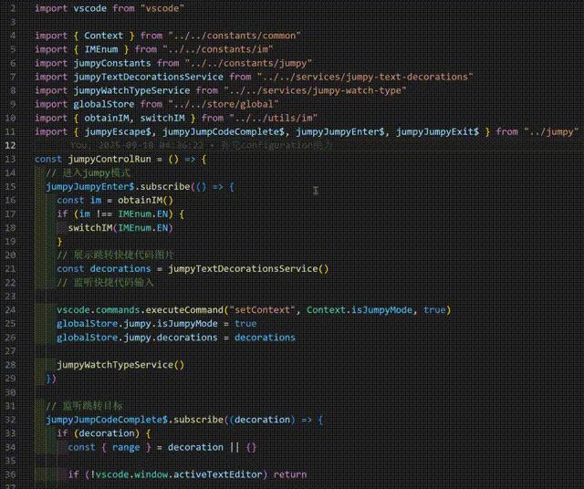

# Jumpy and ime

## 前言

如果符合以下条件，在代码中**有汉字输入需求（注释等）**，**Windows10**，**微软拼音输入法**，则可以安装使用该vscode插件

## 功能概览

聚合[jumpy](https://github.com/wmaurer/vscode-jumpy)、[Smart IME](https://github.com/OrangeX4/vscode-smart-ime)、[IME and Cursor](https://github.com/beishanyufu/ime-and-cursor)和[HyperScopes Booster](https://github.com/yfzhao20/hscopes-booster)的功能，优化各个插件功能衔接，纯node实现。

## ✨主要功能

- 按快捷键`Shift+Enter`即进入`Jumpy mode`
  - 继续输入两次`a-z`即可令光标跳转到对应位置
  - 若第一个`a-z`按错了，按`Escape`可回退重写
  - 按`Enter`直接退出`Jumpy mode`
- 默认设置，进入comment scope会自动设置为`中文模式`，退出comment、string scope会自动设置为`英语模式`
- `ctrl+alt+j`光标向下移动n行，`ctrl+alt+k`光标向上移动n行，

## ❓ 常见问题

**Q: 1.进入了jumpy模式，快捷码太密集了**  
A: 可以修改`wordRegexp`断词正则，都是`|`或逻辑，自行增减

**Q: 2.进入了jumpy模式，光标移动卡顿**  
A: 两个字母有26\*26=676个组合，可以把`maxCodeCount`设置得小一点，减少渲染压力

**Q: 3.我安装了插件，为什么没有智能切换的效果？**  
A: 我是前端，默认支持`js,jsx,ts,tsx,mjs,cjs,vue`的文件后缀。你可以修改`smartImeAssociationExt`、`enterScopesFurtherMatch`和`enterScopesToCnMatch`的组合来尝试是否满足你的场景

**Q: 4.光标的样式和颜色和输入法的模式不一定匹配**  
A: node无法取得输入法模式变化事件。一般情况下，插件根据当前光标scope主动去设置输入法模式后是匹配的，除非用户按了`shift`修改输入法模式导致不对齐。

<!-- ## 问题反馈 -->

<!-- [Create an issue](https://github.com/wmaurer/vscode-jumpy/issues) -->
